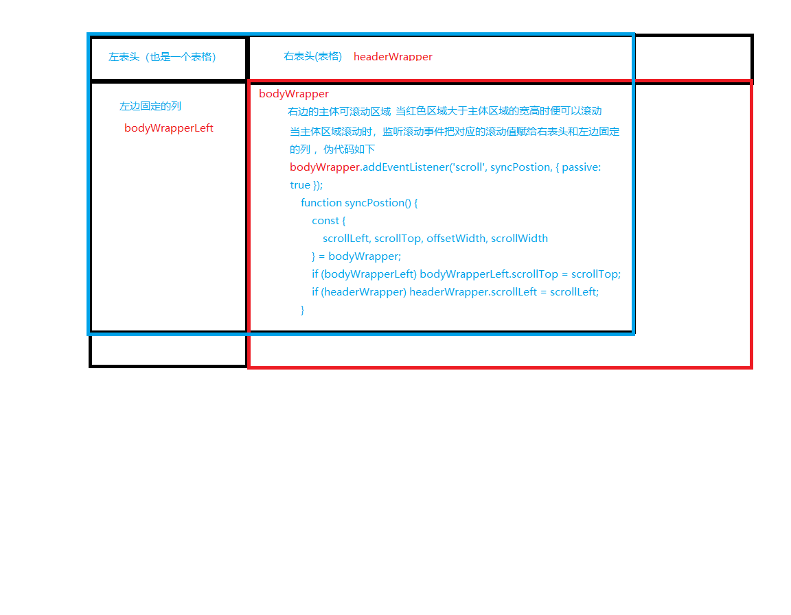

# 表格固定表头和列

## 背景

在项目中大多数的表格，都是使用ui库提供的表格，ui库提供的表格为我们封装了很多很实用的功能，当然也附带了固定表头和列的功能，那么为什么要自己写固定表头和列的表格呢，UI库自带的表格在合并单元格上非常难用，当时我在写一个sku表格，存在单元格的合并，很不方便，所以我选择了原生的表格，在当时看来没有什么问题很方便的解决了我的需求，但是有一个产品提出一个固定表头和列的需求。在网上例子，运行之后都不满意，有的只能固定表头，所以自己写了固定表头和列的表格，思路如下图



代码如下

```
<!DOCTYPE html>
<html lang="en">
<head>
  <meta charset="UTF-8">
  <meta name="viewport" content="width=device-width, initial-scale=1.0">
  <title>Document</title>
  <style>
     .table {
        display: table;
        border-collapse: separate;
        border-spacing: 0;
        border-color: grey;
    }
    td{
        padding: 5px;
        /* border: 1px solid #e6e6e6; */
        background: #f6f7fa;
    }
    .table-left-body td{
            background: #ffffff;
    }
    .table-box{
        position: relative;
        padding: 0;
        width: 800px;
        background-color: rgb(255, 255, 255);
        margin-bottom: 5px;
    }
    .table-left-box{
        overflow: hidden;
        top: 0;
        left: 0;
        max-width: 183px;
        z-index: 100
    }
    .table-right-box{
        position: absolute;
        overflow: hidden;
        top: 0;
        right: 0;
        width: 620px;
    }
    .table-left-body td,.table-right-body td{
            border-top: none;
            background: #ffffff;
    }
    .table-left-body{
        overflow-x: hidden;
        overflow-y: hidden;
        max-width: 183px;
        max-height: 200px;
        
    }
    .table-left-body .table-left-text{
            width: 80px;
            height: 35px;
            line-height: 35px;
        }
    .table-right-body{
        overflow-x: auto;
        overflow-y: auto;
        width: 100%;
        max-height: 200px;
    }
    .table-right-header{
        width: 100%;
        overflow-x: hidden;
        overflow-y: hidden;
    }
    .table-right-text{
        width: 160px;
        height: 35px;
        line-height: 35px;
    }
  </style>
</head>
<body>
  <div class="table-box">
    <div class="table-left-box">
        <div class="table-left-header">
            <div class="">
                <table border="0" cellspacing="0" cellpadding="0">
                    <tbody>
                        <tr>
                            <td class="td color">
                                <div style="width: 80px;height: 35px;line-height: 35px;">
                                    颜   色
                                </div>
                            </td>
                            <td class="td size">
                                <div style="width: 80px;height: 35px;line-height: 35px;">
                                    尺   码
                                </div>
                            </td>
                        </tr>
                    </tbody>
                </table>
            </div>
        </div>
        <div ref="bodyWrapperLeft" class="table-left-body">
            <div style="padding-bottom: 20px;box-sizing: border-box;">
                <table>
                    <tbody>
                        <tr>
                            <td>
                                <div class="table-left-text">
                                  i
                                </div>
                            </td>
                            <td>
                                <div class="table-left-text">
                                  text
                                </div>
                            </td>
                        </tr>
                        <tr>
                            <td>
                                <div class="table-left-text">
                                  i
                                </div>
                            </td>
                            <td>
                                <div class="table-left-text">
                                  text
                                </div>
                            </td>
                        </tr>
                        <tr>
                            <td>
                                <div class="table-left-text">
                                  i
                                </div>
                            </td>
                            <td>
                                <div class="table-left-text">
                                  text
                                </div>
                            </td>
                        </tr>
                        <tr>
                            <td>
                                <div class="table-left-text">
                                  i
                                </div>
                            </td>
                            <td>
                                <div class="table-left-text">
                                  text
                                </div>
                            </td>
                        </tr>
                        <tr>
                            <td>
                                <div class="table-left-text">
                                  i
                                </div>
                            </td>
                            <td>
                                <div class="table-left-text">
                                  text
                                </div>
                            </td>
                        </tr>
                    </tbody>
                </table>
            </div>
        </div>
    </div>
    <div class="table-right-box">
        <div ref="headerWrapper" class="table-right-header">
            <div style="width: 10000px;">
                <table border="0" cellspacing="0" cellpadding="0" class="">
                    <tbody>
                      <tr>
                          <td>
                              <div class="table-right-text">
                                text
                              </div>
                          </td>
                          <td>
                              <div class="table-right-text">
                                text
                              </div>
                          </td>
                          <td>
                              <div class="table-right-text">
                                text
                              </div>
                          </td>
                          <td>
                              <div class="table-right-text">
                                text
                              </div>
                          </td>
                          <td>
                              <div class="table-right-text">
                                text
                              </div>
                          </td>
                      </tr>
                    </tbody>
                </table>
            </div>
        </div>
        <div ref="bodyWrapper" class="table-right-body">
            <table>
              <tbody>
                <tr>
                  <td>
                      <div class="table-right-text">
                        11
                      </div>
                  </td>
                  <td>
                      <div class="table-right-text">
                        11
                      </div>
                  </td>
                  <td>
                      <div class="table-right-text">
                        11
                      </div>
                  </td>
                  <td>
                      <div class="table-right-text">
                        11
                      </div>
                  </td>
                  <td>
                      <div class="table-right-text">
                        11
                      </div>
                  </td>
              </tr>  
              <tr>
                <td>
                    <div class="table-right-text">
                      11
                    </div>
                </td>
                <td>
                    <div class="table-right-text">
                      11
                    </div>
                </td>
                <td>
                    <div class="table-right-text">
                      11
                    </div>
                </td>
                <td>
                    <div class="table-right-text">
                      11
                    </div>
                </td>
                <td>
                    <div class="table-right-text">
                      11
                    </div>
                </td>
            </tr>
            <tr>
              <td>
                  <div class="table-right-text">
                    11
                  </div>
              </td>
              <td>
                  <div class="table-right-text">
                    11
                  </div>
              </td>
              <td>
                  <div class="table-right-text">
                    11
                  </div>
              </td>
              <td>
                  <div class="table-right-text">
                    11
                  </div>
              </td>
              <td>
                  <div class="table-right-text">
                    11
                  </div>
              </td>
          </tr>
          <tr>
            <td>
                <div class="table-right-text">
                  11
                </div>
            </td>
            <td>
                <div class="table-right-text">
                  11
                </div>
            </td>
            <td>
                <div class="table-right-text">
                  11
                </div>
            </td>
            <td>
                <div class="table-right-text">
                  11
                </div>
            </td>
            <td>
                <div class="table-right-text">
                  11
                </div>
            </td>
        </tr>
        <tr>
          <td>
              <div class="table-right-text">
                11
              </div>
          </td>
          <td>
              <div class="table-right-text">
                11
              </div>
          </td>
          <td>
              <div class="table-right-text">
                11
              </div>
          </td>
          <td>
              <div class="table-right-text">
                11
              </div>
          </td>
          <td>
              <div class="table-right-text">
                11
              </div>
          </td>
      </tr>    
              </tbody>
            </table>
        </div>
    </div>
</div>
<script>
    function $(select){
      return document.querySelector(select)
    }
    let bodyWrapper = $('.table-right-body')
    let bodyWrapperLeft = $('.table-left-body')
    let headerWrapper = $('.table-right-header')
    bodyWrapper.addEventListener('scroll', syncPostion, { passive: true });
    function syncPostion() {
        const {
            scrollLeft, scrollTop, offsetWidth, scrollWidth
        } = bodyWrapper;
        if (bodyWrapperLeft) bodyWrapperLeft.scrollTop = scrollTop;
        if (headerWrapper) headerWrapper.scrollLeft = scrollLeft;
    }
</script>
</body>
</html>
```

